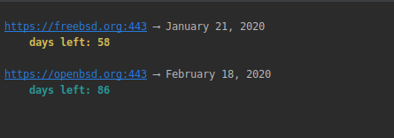

[](https://opensource.org/licenses/BSD-3-Clause)

# certdates

Check the certificate validity period left in all your domains.  Mainly used for checking if auto-renewal of LetsEncrypt
certs are proceeding as expected.

Simply give this script etiher a domain:

Input:

```
./certdates https://freebsd.org
```
 
Output:
 
```
 https://freebsd.org:443 ⟶ January 21, 2020
         days left: 58
```
 
or a text file of domains such as this:

```
https://freebsd.org
https://openbsd.org
```

Input:

```
./certdates --domains="domains.txt" --threshold=60
```

Output:



and give it a threshold of the number of days of validity. For example if you are interested in 
highlighting cases where there is less than 60 days of certificate validity.  

# Compiling

You can compile this to a binary with:

```
go build certdates.go
```

should make a binary in the same directory:

```bash
./certdates
```

